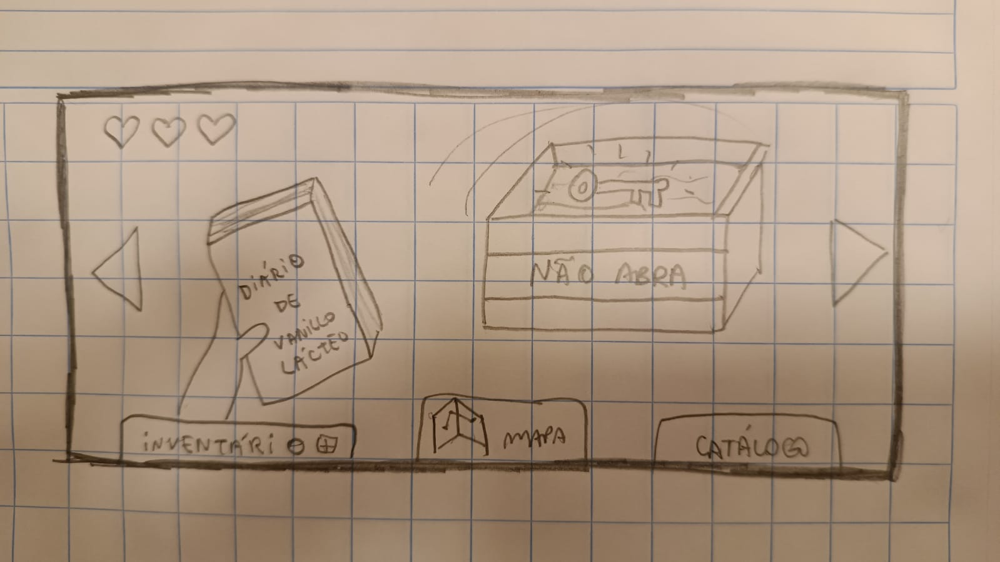
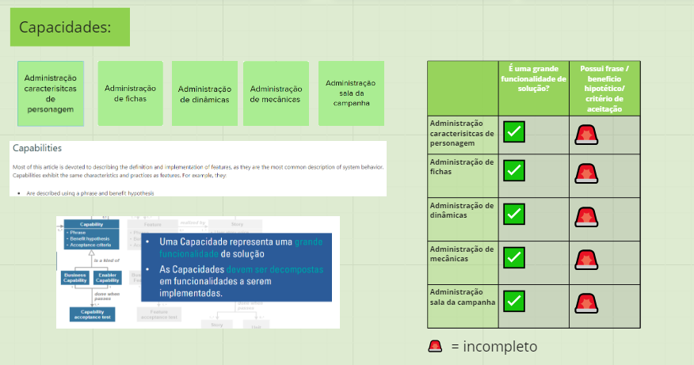

# Atividades e Técnicas de Engenharia de Requisitos

## Introdução

As atividades e técnicas de Engenharia de Requisitos desempenham uma função essencial no desenvolvimento e na construção de um Software que busca atender as necessiades de seus Stakewolders.

Desta forma, temos as seguintes atividades de ER:

- Elicitação e Descoberta
- Análise e Consenso
- Declaração
- Verificação e Validação
- Representação
- Organização e Atualização

### Elicitação e Descoberta
Regularmente sendo tida como um dos primeiros passos no processo de Engenharia de Requisitos, a partir dela podemos identificar uma fonte de informação (Documento, Stakeholders, etc..), visando escolher a técnica mais apropriada para aquele contexto. Além disso, apartir dessa técnica, podemos descobrir e extrair algo que previamente não era conhecido. 

#### Exemplo de técnicas de Elicitação e descoberta:
- Entrevista
- Brainstorming
- Instrospecção
### Análise e Consenso
É uma forma de identificar possíveis conflitos ou incongruências entre os requisitos, a partir de uma análise desses requisitos em suas formas "brutas". Por meio do consenso, podemos estabelecer um concilio entre possíveis fontes de informações divergentes e estabelecer uma compreensão mutua sobre os requisitos. 
#### Exemplo de técnicas de Elicitação e descoberta:
- Resolução de conflito
- Grupo Focal
- Lean Inception
### Declaração
É uma atividade que visa evitar possíveis retrabalhos no projeto, documentando os requisitos de forma com que possam ser utilizados conforme o desenvolvimento e andamento do processo.
#### Exemplo de técnicas de Elicitação e descoberta:
- Temas, Épicos e US
### Representação
Podendo representar os requisitos tanto de forma informal, quanto semiformal e formal, a representação é um atividade que busca apresentar os requisitos por meio de visualização do produto ou por um modelo. 
#### Exemplo de técnicas de Elicitação e descoberta:
- Prototipagem
- Representação em Modelo de Linguagem
### Verificação e Validação
A partir o livro Engenharia de Requisitos da Sheila Reinehr, temos a seguinte citação que "De acordo com a norma internacional ISO/IEC/IEEE 12207 (ISO/IEC/IEEE, 2017, p. 10–11)": 
- Validação seria “a confirmação, por meio do fornecimento de evidência objetiva, que o requisito foi atendido para um uso ou aplicação pretendidos específicos”.
- Enquanto a verificação é “confirmação, por meio do fornecimento de evidência objetiva, que os requisitos especificados foram atendidos”"

Desta forma, temos que a Validação seria uma forma de estabelecer que os requisitos definem uma solução adequada ao projeto, enquanto a Verificação estabeleceria que os requisitos foram realizados de forma que atenda ao objetivo. 

#### Exemplo de técnicas de Elicitação e descoberta:
- Roteiro de Validação
- Roteiro de Verificação
- Revisão
### Organização e Atualização
Conforme o próprio nome da atividade já indica, trata-se de estar constantemente organizando e atualizando de forma adequada um conjunto de requisitos, mantendo eles no seu estado mais atual de forma estruturada, refinada e priorizada.

#### Exemplo de técnicas de Elicitação e descoberta:
## Atividades e Técnicas de ER

No que diz respeito as técnicas de engenharia de requisitos definidas antecipadamente na primeira missão na página [Introdução à Engenharia de Requisitos](https://mdsreq-fga-unb.github.io/2023.2-Crystaleum/missao-1/engenharia-requisitos/) para o planejamento inicial, seguimos e mantivemos uma estrutura similar e parecida ao que previamente haviamos estabelecido, alterando somente alguns métodos que faziam mais sentido para o Backlog nesse momento e para metodologia utilizada.

Portanto, para a definição do Backlog inicial, utilizamos a metodologia (SAFE) a partir de um conjunto de técnicas das atividades de Engenharia de Requisitos para definir os Épicos, Capacidades, Funcionalidades e Histórias de Usuário. 

Desta forma, segue a tabela abaixo para identificar as seguintes atividades e técnicas utilizadas respectivamente em suas ordens para definir o Backlog inicial:

| Nome da atividade | Método | Ferramenta | Entrega |
| ---- | ------ | --------- | --------- |
| Elicitação e Descoberta | Storyboard e Brainstorming| Teams/Miro | Lista de Requisitos RFs e RNFs brutos |
| Análise e Consenso | Feedback | Teams/Miro | Lista de Requisitos RFs e RNFs |
| Declaração | Temas, Épicos e Histórias de Usário  | Tems/Miro| Especificação de Requisitos, História de Usuário |
| Representação| Prototipação Rápida | Papel | Protótipo em Desenho |
| Verificação e Validação | Feedback | Google Docs | Backlog e Priorização de Requisitos |
| Organização e Atualização | Priorização | Teams/Miro | Backlog e Priorização de Requisitos|

### Storyboard - Elicitação e Descoberta
Inicialmente para Elicitação e Descoberta, utilizamos um Storyboard, pensamos em utilizar essa técnica ao invés de qualquer outra, pois nos ajudaria a visualizar quem são os nossos clientes e a quem é destinado o nosso produto. Portanto, definimos em reunião três personas envolvidos no nosso projeto, descrevendo o que eles fazem e esperam do Crystaleum. Sendo elas:

### Brainstorming - Elicitação e Descoberta
Nessa fase da Elicitação e Descoberta, atráves da reunião do grupo foi utilizado um Brainstorming de ideias, a técnica foi escolhia por se apoiar muito na criativade e na imaginação, tendo como objetivo que cada membro gerasse o máximo possível de ideias e agrupassem-nas. Desta maneira, percebemos a importância dela inicialmente para encontrar possíveis problemas e suas soluções no projeto, assim como também identificar os requisitos funcionais e não funcionais, descrevendo  o tanto quanto conseguiamos pensar. 

Segue o Brainstorming de ideias que pensamos sobre possíveis problemas:

### Feedback - Análise e Consenso
O Feedback é uma importante técnica que por meio do cliente ou mesmo da equipe, nos permite identificar como o projeto está progredindo e se está fazendo isso da maneira certa. Assim, através dos Feedbacks dados em sala de aula, conforme o necessário, ajustamos os requisitos funcionais e não funcionais que não se alinhavam aos requisitos. Por meio do [Miro - Moonwalkers](https://miro.com/app/board/uXjVNZqImbk=/), é possível ver a diferença de como definimos inicialmente na fase de elicitação e descoberta e após na atividade de analise e consenso.
  

### Declaração - Temas, Épicos e Histórias de Usário
Utilizamos os Temas, Épicos e Histórias de Usuário como forma de documentar o nosso Backlog, pois além de se alinhar a metodologia utilizada, por meio da granularidade, conseguimos ir dissecando pouco a pouco cada um dos itens. Definimos também um problema principal nessa etapa e uma possível solução. 

### Represetanção - Prototipação rápida
Como forma de representação, foi utilizado desde o início do projeto, a prototipação rápida, utilizando um papel visando demonstrar como o jogo funcionará. Assim, essae protótipo permite que possamos demonstrar de uma forma mais visual aquilo que imaginamos em nossa mente quando pensamos em nosso produto. Desta forma, escolhemos essa técnica, pois ela auxilia tanto na validação quanto na facilitação da comunicação do Crystaleum.
#### Protótipo feito no início da disciplina

#### Protótipo mais recente

#### Protótipo do mapa do jogo

### Verificação e Validação - Feedback
O Feedback foi utilizado de forma externa, por meio de um grupo que avaliou nosso Backlog utilizando outras técnicas de Verificação e Validação. O documento está no seguinte acesso: [Documento- Insurgentes](https://docs.google.com/document/d/1LQgYhpjF86tWoar6K5Ryrx_JWKtUVAh7q3pIY0Bezts/edit#heading=h.br6rd3ecyvvx). Utilizamos esse feedback como forma de orientação para ajustar incongruências no Backlog.

### Organização e Atualização - Priorização
Inicialmente, utilizamos um gráfico de Priorização com um relação entre importância e viabilidade. Estabelecemos gráficos para as capacidades, funcionalidades e história dos usuários. Essa priorização foi realizada inicialmente com uma parcela do grupo, no entanto, após refletirmos e avaliarmos em uma outra reunião, percebemos que poderia haver uma forma melhor de estimarmos os valores de nossas histórias.

### Organização e Atualização - Priorização
Anteriormente haviamos definido importância e a viabilidade como métrica para definirmos o valor das histórias, no entanto, achamos melhor adicionar também uma categoria de complexidade, pois já estavamos abstraindo isso na questão da viabilidade, o que dificultava estabelecer a localização de cada história no gráfico, e por conta disso, decidimos mudar nossa priorização para uma tabela de valores de 1 a 3 para Valor de Negócio e Viabilidade e 3 à 1 para a complexidade. Estabelecemos um cálculo de (Total=Va*Vi/Co) e tomamos as histórias com maiores resultados para o MVP 1. 

Fonte: [Miro - Moonwalkers](https://miro.com/app/board/uXjVNZqImbk=/)

Fonte: [Documento (Google Docs) - Insurgentes](https://docs.google.com/document/d/1LQgYhpjF86tWoar6K5Ryrx_JWKtUVAh7q3pIY0Bezts/edit#heading=h.br6rd3ecyvvx)
 
## Avaliação
Além das técnicas utilizadas para a criação do backlog do Crystaleum, foi utilizado também técnicas de Verificação e Validação para avaliar o Backlog de outro grupo (Insurgentes). Desta forma, achamos adequado utilizar como técnicas:

- Invest 
- Checklist de Validação
- Checklist de Verificação

### Invest
A técnica INVEST acrônimo para Independent, Negotiable, Valuable, Estimable, Small e Testable foi utilizada pelo grupo pensando em como ela estabelece critérios muito importantes que definem a qualidade de uma história. Desta forma, temos como objetivo identificar se as histórias de usuários foram bem escritas tendo como métrica e referência cada um dos atributos abaixo: 

#### Imagem do INVEST sendo aplicado nas US do grupo

### Checklist de Validação
O grupo decidiu utilizar a Checklist de Validação como maneira de validar se os requisitos se adequam a partir de um conjunto de item estabelecidos tendo como alternativa a resposta "Sim" ou "Não" para cada um deles. A partir de uma resposta positiva, conseguimos compreender que para aquele item, o requisito está adequado, enquanto para resposta negativa, entedemos que existe alguma incongruência que deve ser ajustada para que o requisito esteja correto. Desta forma, a tabela leva em consideração a ambíguidade, consistência e se o requisito está completo, auxiliando-nos a identificar se ele é válido.

### Checklist de Verificação
Da mesma forma, escolhemos para a atividade de verificação, a técnica de Checklist também, sendo desta vez utilizada como forma de verificação para as Capacidades e analisando se estão apropriadas tendo em vista dois aspectos, sendo eles, se a capacidade representa uma grande funcionalidade e se está de acordo com a sua padronização.

Fonte: [Miro (Validação e Verificação [Insurgentes] - Moonwalkers](https://miro.com/app/board/uXjVNYkAabA=/)

## Atualizações no Backlog
Uma avaliação foi realizada por parte de outro grupo (Insurgentes) utilizando técnicas de ER como Verificação e Validação no nosso Backlog inicial. Assim, foram utilizado por parte deste grupo as seguintes técnicas:
- INVEST como forma de verificar se as US foram bem escritas;
- Checklist como forma de verificar a estrutura da US (Ator, Ação, Valor de negócio);
- Checklist para verificar a qualidade do backlog (Segue a estrutura do SAFe);
- Checklist para validar as US (Declaração do produto, Objetivo, Problema).

Conforme as recomendações do grupo, alteramos e ajustamos alguns detalhes do Backlog seguindo suas orientações e observações. Além disso, por meio do Feedback geral descrito no final do documento entregue, observamos as incongruências ou falta de alguns objetos e padronizações estabelecidas na metologia utilizada (SAFE). No entanto, discordamos de algumas ponderações, tais quais algumas funcionalidade e histórias de usuário que o grupo avaliador acreditava não estar adequado por serem requisitos não funcionais, o que mantivemos conforme acreditamos estar alinhado tanto ao Backlog do nosso produto quanto no que diz respeito as funcionalidades.

Fonte: [Documento (Google Docs) - Insurgentes](https://docs.google.com/document/d/1LQgYhpjF86tWoar6K5Ryrx_JWKtUVAh7q3pIY0Bezts/edit#heading=h.br6rd3ecyvvx)

## Referências Bibliográficas

> <a id="l1" href="#anchor_1"> 1. </a> REINEHR, Sheila. Engenharia de requisitos.  Grupo A, 2020. 

> <a id="l2" href="#anchor_1"> 2.</a> Requirements Engineering: A Roadmap, Nuseibeh, Bashar & Easterbrook, Steve

> <a id="l3" href="#anchor_1"> 3.</a> Software Requirements Engineering: An Overview, Jitnah, Daniel & Steele, Phillip

## Histórico de Versão

| Versão | Data       | Descrição         | Autor(es)                                        |
| ------ | ---------- | ----------------- | ------------------------------------------------ |
| 1.0    | 22/10/2023 | Criação da página | [Suzane Duarte](https://github.com/suzaneduarte) |
| 1.1    | 25/10/2023 | Descrição das atividades, avaliação e introdução de Engenharia de ER | [Pedro Henrique](https://github.com/PedroHhenriq) |
| 1.2    | 25/10/2023 | Incrimentos, ajustes e adição das imagens | [Pedro Henrique](https://github.com/PedroHhenriq) |
| 1.3    | 26/10/2023 | Pequenos ajustes e descrições  | [Pedro Henrique](https://github.com/PedroHhenriq) |

