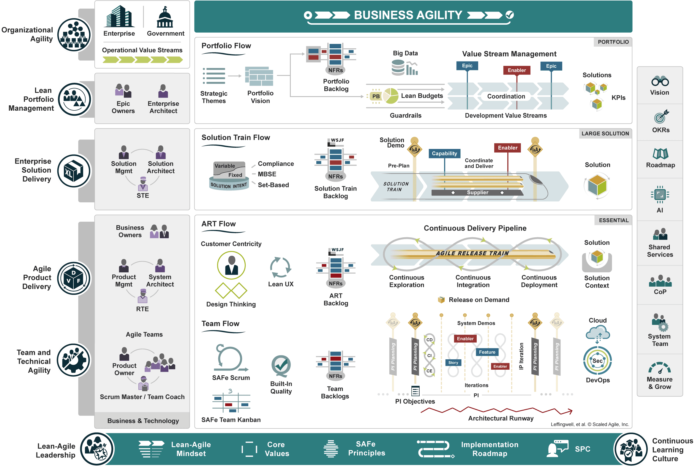

# SAFe e User Story
O SAFe 6.0 é uma base de conhecimento de princípios, práticas e competências comprovados e integrados para obter agilidade nos negócios usando Lean, Agile e DevOps  [3](#referências-bibliográficas).  

O SAFe (Scaled Agile Framework) [2](#referências-bibliográficas), como o próprio nome explica, é um framework que visa escalar os princípios e práticas ágeis. Ele é adaptável a organizações de diferentes tamanhos e propõe incrementos ao framework de acordo com as necessidades de uma organização maior e mais robusta. 

O framework foi dividido nas seguintes escalas, de forma crescente em tamanho da organização:
Essential, Large solution, Portifolio, Full 

Observe a grande diferença entre o Essential SAFe (Figura 1) para pequenas organizações, pessoas e times e o Full SAFe (Figura 2), desenvolvido para uma escala de grandes organizações.

**Figura 1 - Essential SAFe (Fonte: Scaled Agile Framework. Acesso em: 24/10/2023.)**

**Figura 2 - Full SAFe (Fonte: Scaled Agile Framework. Acesso em: 24/10/2023.)**

## Modelo de requisitos do SAFe
O SAFe descreve uma hierarquia de quatro níveis de artefatos (itens de Backlog)  que
descrevem o comportamento funcional do sistema. O trabalho detalhado de implementação é expresso por meio de histórias, o nível mais baixo da hierarquia, com maior granularidade.

**Figura 3 - Meta-Modelo de Requisitos - Ágeis (Fonte: Slides de aula Prof. Dr. George Marsicano, 2023 Acesso em: 25/10/2023.)**

### Epico (Epic)
E uma iniciativa de desenvolvimento de solução
significativa e o nivel com menor granularidade.

Devido ao seu escopo e impacto consideráveis, os
épicos requerem a definição de um Produto Mínimo
Viável (MVP). Existem Épicos de negócios e Épicos facilitadores, o primeiro tipo sao aqueles que agregam valor comercial
diretamente e o segundo e para dar suporte às necessidades comerciais ou
técnicas futuras.

### Capacidade (Capability)
Uma Capacidade representa uma grande funcionalidade de solução. Capacidades realizam (compõem) Epicos.

### Funcionalidade (Feature)
Representa uma parte funcional da solução que fornece valor comercial, atende a uma necessidade das partes interessadas. Inclui uma hipótese de
benefício e critérios de aceitação.
Funcionalidades realizam (compõem) capatidades.

### Historias (User Story)
As Histórias são descrições curtas de uma pequena parte da funcionalidade desejada, escritas da perspectiva do usuário. As histórias são o principal artefato usado
para definir o comportamento do sistema no Agile.
É um comportamento pequeno e independente que pode ser
implementado de forma incremental e fornece algum valor para o
usuário ou para a solução
Histórias é o nivel com maior granularidade.
Histórias realizam (compõem) funcionalidades.

## Como a equipe aplica o SAFe na engenharia de requisitos?

O backlog dos Moonwalkers para construir o jogo Crystaleum foi dividido de acordo com o Meta-Modelo de Requisitos do SAFe, demonstrado na Figura 4.

**Figura 4 - Requisitos do Crystaleum (Fonte: Autores. Disponivel no [miro](https://miro.com/app/board/uXjVNZqImbk=/) )**

## Referências Bibliográficas

> <a id="l1" href="#anchor_1">1.</a> Livro:

Leffingwell, Dean. Agile Software Requirements.
>
> <a id="l2" href="#anchor_2">2.</a> Website:

Scaled Agile Framework. 

Disponível em: https://www.scaledagileframework.com/#.   Acesso em: 24/10/2023.

> <a id="l3" href="#anchor_3">3.</a> Slides de aula Prof. Dr. George Marsicano

Requisitos de
Software
Scale Agile Framework - SAFe

## Histórico de Versão

| Versão | Data       | Descrição         | Autor(es)                                        |
| ------ | ---------- | ----------------- | ------------------------------------------------ |
| 1.0    | 22/10/2023 | Criação da página | [Suzane Duarte](https://github.com/suzaneduarte) |
| 2.0    | 25/10/2023 | Adicionando conteudo | [Ana Carolina Costa Cesar](https://github.com/CarolCoCe) |
