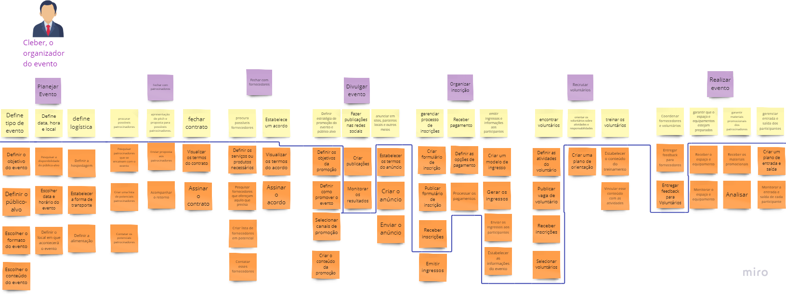
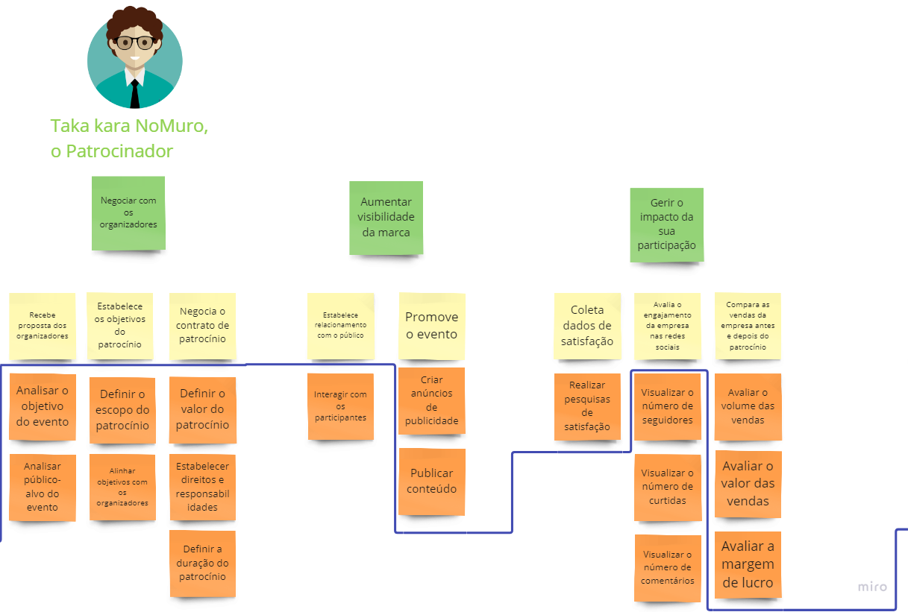

# User Story Mapping - Estudo de Caso (ComunEventos)

## Introdução

De acordo com Marsicano (2023), podemos entender o  User Story Mapping (USM) como um conjunto de técnicas iterativas que auxiliam a visualizar os requisitos como uma forma de jornada ou uma história construindo uma forma compartilhada de entendimento através da simplicidade e visualidade. A partir disso, utilizamos a USM para realizar um exercício prático de construção de Backlog utilizando a técnica dentro de uma estudo de caso de uma empresa fictícia chamado ComunEventos.

Tomamos o seguinte contexto orientado para esse estudo de caso: 

Não obstate, o documento do estudo conta com muitas outras definições que nos auxilia a compreender de forma mais clara o estudo de caso contando com objetivos do negócio, objetivos do aplicativo, definições de processo de negócio e descrições de algumas personas, assim como suas necessidades para esse projeto. Desta forma, utilizamos essas descrições como base para montar e mapear o User Story Mapping abaixo.

## Miro Utilizado para confecção do USM

<iframe width="768" height="432" src="https://miro.com/app/board/uXjVNOv3H60=/" frameborder="0" scrolling="no" allow="fullscreen; clipboard-read; clipboard-write" allowfullscreen></iframe>

## Personas 

De acordo com o estudo de caso (ComunEventos), definimos 4 personas para o User Story Mapping, sendo elas ordenadas na seguinte posição:

1. O Organizador do evento (Cleber) 
2. O Patrocinador (Taka)
3. O Participante (Aladdin)
4. A Voluntária (Wandinha)

## Atividades e Tarefas

Após definirmos as personas, descrevemos as atividades, organizando-as conforme uma linha narrativa da persona, seguindo uma ordem que contaria as histórias dela conforme definido no USM. Posteriormente, estabelecemos as tarefas (histórias) para cada uma dessas atividades. 

Além disso, priorizamos conforme o contexto do produto e suas necessidades, levando em consideração o que entraria no MVP. Seguindo modelo do User Story Mapping, definimos uma trajetória por meio de uma linha azul em que as tarefas (histórias) na parte superior definem o que estabelecemos como MVP para o produto para cada uma das personas, enquanto que os itens que estão abaixo da linha estariam fora.

Segue as atividades e tarefas conforme cada persona:

### Organziador (Cleber)

### Patrocinador (Taka)

### Participante (Aladdin)

### Voluntária (Wandinha)

## Referências Bibliográficas

> <a id="l1" href="#anchor_1"> 1.</a> Slides de aula (Unidade 4 - USM) Prof. Dr. George Marsicano

| Versão | Data       | Descrição          | Autor(es)                                        |
| ------ | ---------- | ------------------ | ------------------------------------------------ |
|1.0     | 22/11/2023 | Criação da Página | [Pedro Henrique](https://github.com/PedroHhenriq)  |