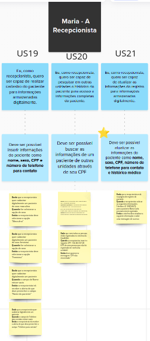

# BDD

Segundo Marsicano (2023), Behavior Driven Development (BDD) é uma especificação
executável para validar os critérios de aceite de uma história.
BDD é descrita em linguagem natural.
BDD segue a perspectiva de desenvolvimento orientada a
especificações.

Com a utilização de cenários de BDD a lista de critérios de
aceitação pode ser substituída por um ou mais cenários.
Devemos fazer o PBB a partir de uma dinâmica que consiste em vivenciar, na prática, a elaboração e criação de um backlog efetivo e colaborativo. Envolve todas as pessoas que irão trabalhar no produto, esclarecendo as histórias de usuário e o backlog dos times, utilizando o PBB Canvas como ferramenta de facilitação.

Foi proposta uma atividade pelo professor George Marsicano na qual depois de fazermos a atividade do PBB. Utilizarmos o PBB de outro grupo, no nosso caso, o Insurgentes, e fazer o BDD a partir dele.

Antes de começar a fazer o BDD nós fizemos uma verificação e validação no PBB feito pelos insurgestes, a qual também está no MIRO e está sendo mais detalhada nesta [secção](avaliacao-insurgentes.md).

## **MIRO com o BDD feito pelos Moonwalkers a partir do PBB feito pelos Insurgentes**

<iframe width="768" height="432" src="https://miro.com/app/board/uXjVNWRzFnM=/" frameborder="0" scrolling="no" allow="fullscreen; clipboard-read; clipboard-write" allowfullscreen></iframe>

# Cenários do BDD
Retirados do MIRO, os tópicos abaixo são capturas de cada parte do canvas. As estrelinhas amarelas representam US ou critérios de aceitação nos quais detectamos problemas.

## Cenários - Paciente

<b>Fonte:</b> <a href="https://miro.com/app/board/uXjVNWRzFnM=/ target="_blank">Miro Moonwalkers</a>

## Cenários - Diretor de tecnologia

<b>Fonte:</b> <a href="https://miro.com/app/board/uXjVNWRzFnM=/ target="_blank">Miro Moonwalkers</a>

## Cenários - Farmacêutica

<b>Fonte:</b> <a href="https://miro.com/app/board/uXjVNWRzFnM=/ target="_blank">Miro Moonwalkers</a>

## Cenários - Coordenador de agendamento

<b>Fonte:</b> <a href="https://miro.com/app/board/uXjVNWRzFnM=/ target="_blank">Miro Moonwalkers</a>

## Cenários - Recepcionista

<b>Fonte:</b> <a href="https://miro.com/app/board/uXjVNWRzFnM=/ target="_blank">Miro Moonwalkers</a>

## Cenários - Médico

<b>Fonte:</b> <a href="https://miro.com/app/board/uXjVNWRzFnM=/ target="_blank">Miro Moonwalkers</a>

# Referências Bibliográficas

> <a id="l1" href="#anchor_1"> 1.</a> Slides de aula Prof. Dr. George Marsicano