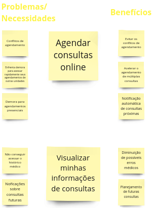
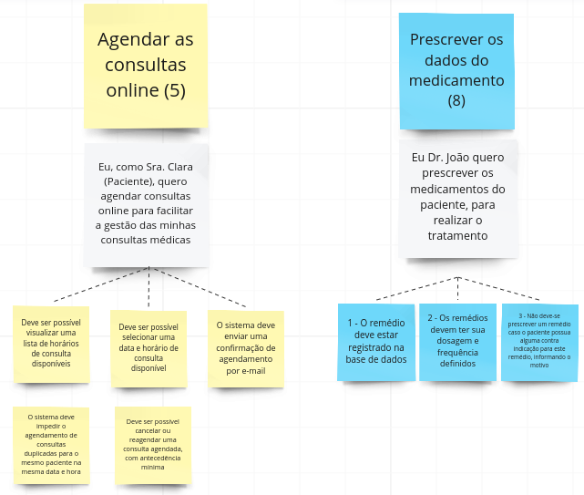

# PBB

Segundo Marsicano (2023), o Product Backlog Building (PBB) é um método para a elaboração e criação de um Product Backlog, enquanto o Canvas PBB é a ferramenta que facilita o método de Product Backlog Building. O objetivo do PBB é ajudar na construção e no refinamento do Product Backlog de forma colaborativa – construindo um entendimento compartilhado e levando todos os envolvidos à compreensão do produto – e na preparação do backlog para o time começar a trabalhar de modo ágil e eficaz.

Devemos fazer o PBB a partir de uma dinâmica que consiste em vivenciar, na prática, a elaboração e criação de um backlog efetivo e colaborativo. Envolve todas as pessoas que irão trabalhar no produto, esclarecendo as histórias de usuário e o backlog dos times, utilizando o PBB Canvas como ferramenta de facilitação.

Foi proposta uma atividade pelo professor George Marsicano na qual criamos um PBB para a HealthNet, uma rede de hospitais fictícia, com muitos problemas e fizemos o estudo de caso para aprender a como planejar uma solução.

## **MIRO com o PBB feito pelos Moonwalkers**

<iframe width="768" height="432" src="https://miro.com/app/board/uXjVNWRzFnM=/" frameborder="0" scrolling="no" allow="fullscreen; clipboard-read; clipboard-write" allowfullscreen></iframe>

Retirados do MIRO, os tópicos abaixo são capturas de cada parte do canvas.

## Problemas

<b>Fonte:</b> <a href="https://miro.com/app/board/uXjVNWRzFnM=/ target="_blank">Miro Moonwalkers</a>

## Expectativas

<b>Fonte:</b> <a href="https://miro.com/app/board/uXjVNWRzFnM=/ target="_blank">Miro Moonwalkers</a>

## Personas

<b>Fonte:</b> <a href="https://miro.com/app/board/uXjVNWRzFnM=/ target="_blank">Miro Moonwalkers</a>

<b>Fonte:</b> <a href="https://miro.com/app/board/uXjVNWRzFnM=/ target="_blank">Miro Moonwalkers</a>

<b>Fonte:</b> <a href="https://miro.com/app/board/uXjVNWRzFnM=/ target="_blank">Miro Moonwalkers</a>

<b>Fonte:</b> <a href="https://miro.com/app/board/uXjVNWRzFnM=/ target="_blank">Miro Moonwalkers</a>

<b>Fonte:</b> <a href="https://miro.com/app/board/uXjVNWRzFnM=/ target="_blank">Miro Moonwalkers</a>

<b>Fonte:</b> <a href="https://miro.com/app/board/uXjVNWRzFnM=/ target="_blank">Miro Moonwalkers</a>

## Features

<b>Fonte:</b> <a href="https://miro.com/app/board/uXjVNWRzFnM=/ target="_blank">Miro Moonwalkers</a>

<b>Fonte:</b> <a href="https://miro.com/app/board/uXjVNWRzFnM=/ target="_blank">Miro Moonwalkers</a>

<b>Fonte:</b> <a href="https://miro.com/app/board/uXjVNWRzFnM=/ target="_blank">Miro Moonwalkers</a>

<b>Fonte:</b> <a href="https://miro.com/app/board/uXjVNWRzFnM=/ target="_blank">Miro Moonwalkers</a>

<b>Fonte:</b> <a href="https://miro.com/app/board/uXjVNWRzFnM=/ target="_blank">Miro Moonwalkers</a>

## PBI

<b>Fonte:</b> <a href="https://miro.com/app/board/uXjVNWRzFnM=/ target="_blank">Miro Moonwalkers</a>

## PBI priorizado - COORG (Método de priorização)

Para realizar a priorização do itens do backlog, utilizamos o método COORG. O cálculo dessa prioridade está descrito na tabela a seguir:

|                   |     | Classificar |     |     |     |
| ----------------- | --- | ----------- | --- | --- | --- |
| Frequência de uso | H:5 | D:4         | S:3 | M:2 | T:1 |
| Valor de negócio  | -   | -           | A:3 | M:2 | B:1 |

Fórmula da prioridade: (+) frequência (+) valor

<b>Fonte:</b> <a>Marsicano (2023)</a>

<b>Fonte:</b> <a href="https://miro.com/app/board/uXjVNWRzFnM=/ target="_blank">Miro Moonwalkers</a>

## Critérios de aceitação das USs

<b>Fonte:</b> <a href="https://miro.com/app/board/uXjVNWRzFnM=/ target="_blank">Miro Moonwalkers</a>

<b>Fonte:</b> <a href="https://miro.com/app/board/uXjVNWRzFnM=/ target="_blank">Miro Moonwalkers</a>

<b>Fonte:</b> <a href="https://miro.com/app/board/uXjVNWRzFnM=/ target="_blank">Miro Moonwalkers</a>

<b>Fonte:</b> <a href="https://miro.com/app/board/uXjVNWRzFnM=/ target="_blank">Miro Moonwalkers</a>

<b>Fonte:</b> <a href="https://miro.com/app/board/uXjVNWRzFnM=/ target="_blank">Miro Moonwalkers</a>

<b>Fonte:</b> <a href="https://miro.com/app/board/uXjVNWRzFnM=/ target="_blank">Miro Moonwalkers</a>

<b>Fonte:</b> <a href="https://miro.com/app/board/uXjVNWRzFnM=/ target="_blank">Miro Moonwalkers</a>

<b>Fonte:</b> <a href="https://miro.com/app/board/uXjVNWRzFnM=/ target="_blank">Miro Moonwalkers</a>

<b>Fonte:</b> <a href="https://miro.com/app/board/uXjVNWRzFnM=/ target="_blank">Miro Moonwalkers</a>

## Referências Bibliográficas

> <a id="l1" href="#anchor_1"> 1.</a> Slides de aula Prof. Dr. George Marsicano
