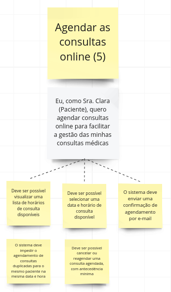

# PBB

Segundo Marsicano (2023), o Product Backlog Building (PBB) é um método para a elaboração e criação de um Product Backlog, enquanto o Canvas PBB é a ferramenta que facilita o método de Product Backlog Building. O objetivo do PBB é ajudar na construção e no refinamento do Product Backlog de forma colaborativa – construindo um entendimento compartilhado e levando todos os envolvidos à compreensão do produto – e na preparação do backlog para o time começar a trabalhar de modo ágil e eficaz.

Devemos fazer o PBB a partir de uma dinâmica que consiste em vivenciar, na prática, a elaboração e criação de um backlog efetivo e colaborativo. Envolve todas as pessoas que irão trabalhar no produto, esclarecendo as histórias de usuário e o backlog dos times, utilizando o PBB Canvas como ferramenta de facilitação.

Foi proposta uma atividade pelo professor George Marsicano na qual criamos um PBB para a HealthNet, uma rede de hospitais fictícia, com muitos problemas e fizemos o estudo de caso para aprender a como planejar uma solução.

## **MIRO com o PBB feito pelos Moonwalkers**

<iframe width="768" height="432" src="https://miro.com/app/board/uXjVNWRzFnM=/" frameborder="0" scrolling="no" allow="fullscreen; clipboard-read; clipboard-write" allowfullscreen></iframe>

Retirados do MIRO, os tópicos abaixo são capturas de cada parte do canvas.

## Problemas

- Processos manuais;
- Processo lento e demorado;
- Erro ao inserir detalhes das prescrições no sistema da farmácia;
- Falta de organização; 
- Sistema desatualizado; 
- Dificuldade de rastreamento de medicamentos; 
- Redundância de sistemas desnecessários; 
- Risco médico para o paciente; 
- Dificuldade em garantir a integridade dos dados dos pacientes; 
- Informações incompletas; 
- Falta de informações; 
- Falta de verificação automática de interações medicamentosas; 
- Agendamento não integrado e conflituoso; 

<b>Fonte:</b> <a href="https://miro.com/app/board/uXjVNWRzFnM=/ target="_blank">Miro Moonwalkers</a>

## Expectativas

- Interface amigável; 
- Entrada de dados fácil e rápida; 
- Acesso ao prontuário completo dos pacientes pelos médicos e eles mesmos; 
- Acessar informações detalhadas das prescrições e dos medicamentos; 
- Ser alertado sobre interações medicamentosas; 
- Paciente conseguir acessar seu histórico médico; 
- Sistema integrado; 
- Estrutura unificada; 
- Alterar de forma rápida e otimizada as agendas dos médicos e pacientes; 
- Paiente conseguir acessar suas consultas;
- Paciente conseguir acessar os resultados dos seus exames; 
- Sistema seguro; 
- Sistema conforme as regulamentações pertinentes; 
- Inserir notas e prescrições de forma eficiente; 

<b>Fonte:</b> <a href="https://miro.com/app/board/uXjVNWRzFnM=/ target="_blank">Miro Moonwalkers</a>

## Personas

### **Maria, A recepcionista**

-> O que faz:

- Registra novos pacientes; 
- Atualiza informações de pacientes regulares; 
- Lida com pacientes frustrados; 

-> Necessidades:

- Cadastrar as informações dos pacientes; 

### **Dr. João, O Clínico Geral**

-> O que faz:

- Atende pacientes; 
- Prescreve receitas; 
- Realiza anotações de observações sobre os pacientes; 

-> Necessidades:

- Acessar os dados dos pacientes de outras unidades; 

### **Sra. Clara, A paciente**

-> O que faz:

- Passa os dados pessoais para a recepcionista; 
- Marca consultas com a recepcionista do HealthNet;
- Frequenta consultas na HealthNet;

-> Necessidades:

- Acessar seu histórico médico e resultados de exames de todas as unidades da HealthNet;
- Agendar consultas online; 
- Ser notificada sobre suas próximas consultas; 

### **Lívia, A farmacêutica**

-> O que faz:

- Dispensa medicamentos de acordo com a receita; 
- Insere os dados detalhados das prescrições no sistema da farmácia; 

-> Necessidades:

- Receber alertas de interações medicamentosas; 
- Visualizar detalhes sobre cada medicamento; 

### **Rafael, O Coordenador de Agendamento**

-> O que faz:

- Gerencia o agendamento de consultas dos médicos e especialistas da clínica; 
- Reagenda pacientes em caso de conflitos; 
- Verifica a disponibilidade dos médicos; 

-> Necessidades:

- Acessar a agenda dos médicos e pacientes; 

### **Sr. Roberto, Diretor de Tecnologia**

-> O que faz:

- Supervisiona toda a infraestrutura tecnológica da HealthNet; 
- Busca soluções para aprimorar a eficiência operacional; 

-> Necessidades:

- Gerar relatórios de conformidade; 

## Features

### **Features derivadas da Paciente:** 

#### Agendar consultas online 

-> Problemas/Necessidades: 

- Conflitos de agendamento; 
- Enfrenta demora para acessar rapidamente seus agendamentos de outras unidades; 
- Demora para agendamentos presenciais; 

-> Benefícios: 

- Evitar os conflitos de agendamentos; 
- Acelerar o agendamento de múltiplas consultas; 
- Notificações automáticas de próximas consultas; 

#### Visualizar minhas informações de consultas 

-> Problemas/Necessidades: 

- Não conseguir acessar o histórico médico; 
- Receber notificações sobre consultas futuras; 

-> Benefícios: 

- Diminuição de possíveis erros médicos; 
- Planejamento de futuras consultas; 

### **Feature derivada do Clínico Geral:** 

#### Preescrever receitas

-> Problemas/Necessidades: 

- Não conseguir acessar o histórico médico completo dos pacientes; 
- Falta de integração entre as unidades; 
- Falta de informações essenciais; 

-> Benefícios: 

- Verificação automática de interações medicamentosas; 

### **Feature derivada do Clínico Geral + Paciente:** 

#### Acessar prontuário

-> Problemas/Necessidades: 

- Desinformação dos próprios pacientes em relação aos seus prontuários; 
- Não conseguir acessar informações completas de pacientes; 
- Não conseguir verificar observações relevantes sobre um paciente regular; 

-> Benefícios: 

- Acesso rápido e fácil aos prontuários; 
- Acesso rápido aos dados dos pacientes; 

### **Feature derivada da Recepcionista:** 

#### Registra e atualiza dados de pacientes 

-> Problemas/Necessidades: 

- Processo lento e demorado; 
- Falta de integração entre as unidades; 
- Agendamento não integrado e conflituoso entre diferentes unidades da HealthNet; 

-> Benefícios: 

- Registrar pacientes de forma rápida e fácil; 
- Atualizar informações sem atrasos; 

### **Feature derivada da farmacêutica:** 

#### Visualizar os detalhes das prescrições no sistema

-> Problemas/Necessidades: 

- Não conseguir identificar as interações medicamentosas; 
- Inserir manualmente aumentando a probabilidade de erros;

-> Benefícios: 

- Informações detalhadas dos medicamentos; 
- Informações claras sobre prescrições realizadas; 
- Receber alertas de conflitos medicamentosos para evitar possíveis erros; 

#### Registrar dispensa de medicamentos de acordo com a receita

-> Problemas/Necessidades: 

- Dispensa manual 
- Ter que inserir os detalhes das prescrições manualmente; 

-> Benefícios: 

- Acesso rápido aos medicamentos dispensados; 
- Maior controle; 

### **Feature derivada do Coordenador de Agendamentos:** 

#### Gerenciar o agendamento

-> Problemas/Necessidades: 

- Sistema ineficiente; 
- Reagendamentos frequentes; 
- Processo lento e desgastante; 

-> Benefícios: 

- Sistema de agendamento unificado que permite ajustes de maneira fácil; 
- Notificações automáticas sobre agendamentos para os pacientes;  

### **Feature derivada do Diretor de Tecnologia:** 

#### Gerar relatório de conformidade

-> Problemas/Necessidades: 

- Suscetível a erros de regulamentação que podem resultar em penalidades para a empresa; 
- Coletar dados de vários sistemas distintos; 
- Processo demorado; 

-> Benefícios: 

- Apenas uma base de dados para a consulta; 
- Evitar processos manuais; 

## PBI

### **Feature: Registra e atualiza pacientes** 

- Atualiza os dados dos pacientes; 
- Registra os dados dos novos pacientes; 

### **Feature: Preescrever receitas** 

- Preescrever os dados do medicamento; 
- Verificar as interações medicamentosas do paciente; 

### **Feature: Visualizar minhas informações de consultas** 

- Visualizar o meu histórico médico; 
- Visualizar as datas das minhas consultas; 
- Visualizar os resultados dos meus exames; 

### **Feature: Agendar consultas online** 

- Agendar as consultas online no meu perfil; 
- Receber notificações de consultas próximas no meu próprio perfil; 

### **Feature: Visualizar os detalhes das prescrições no sistema** 

- Visualizar os detalhes das prescrições no sistema; 
- Alertar sobre interações medicamentosas ao farmacêutico; 

### **Feature: Registrar dispensa de medicamentos de acordo com a receita** 

- Acessar a lista de medicamentos dispensados; 
- Registrar a dispensa de um medicamento; 

### **Feature: Gerenciar o agendamento** 

- Atualizar informações de consultas; 

### **Feature: Acessar o prontuário de todos os pacientes** 

- Visualizar os resultados de exames de todos os pacientes; 
- Visualizar histórico de todos os pacientes; 
- Inserir observações sobre qualquer paciente dentro do prontuário; 

### **Feature: Gerar relatórios de conformidade** 

- Gerar relatórios de regulamentação da HealthNet;

## PBI priorizado - COORG (Método de priorização)

Para realizar a priorização do itens do backlog, utilizamos o método COORG. O cálculo dessa prioridade está descrito na tabela a seguir:

|                   |     | Classificar |     |     |     |
| ----------------- | --- | ----------- | --- | --- | --- |
| Frequência de uso | H:5 | D:4         | S:3 | M:2 | T:1 |
| Valor de negócio  | -   | -           | A:3 | M:2 | B:1 |

Fórmula da prioridade: (+) frequência (+) valor

<b>Fonte:</b> <a>Marsicano (2023)</a>

|Resultado do Cálculo| Registra e atualiza pacientes| Agendar consultas online no meu perfil| Visualizar informações de consultas| Gerenciar os agendamentos| Acessar prontuário|Preescrever Receitas| Visualizar os detalhes das prescrições no sistema|Registrar dispensa de medicamentos de acordo com a receita| Gerenciar Relatório de conformidade|
|--|--|--|--|--|--|--|--|--|--|
|8|Registrar os dados dos novos pacientes| | | | Visualizar o histórico do paciente pelo prontuário    Visualizar os resultados de exames dos pacientes pelo prontuário|Preescrever os dados do medicamento|Visualizar os detalhes das prescrições no sistema|Registrar a dispensa de um medicamento| |
|7|Atualizar os dados dos pacientes| | | Atualizar informações de consulta| | Verificar as interações dos medicamentos do paciente| | Acessar a lista de medicamentos dispensados| |
|6| | | | |Inserir observações sobre o paciente dentro do prontuário| | Notificar sobre interações medicamentosas ao farmacêutico| | |
|5| | Agendar as consultas online no meu perfil| Visualizar as datas das minhas consultas    Visualizar os resultados dos meus exames| | | | | | |
|4| | Receber notificações de consultas próximas no meu perfil| Visualizar o meu histórico médico| | | | | | Gerar relatórios de conformidade da HealthNet|
|3| | | | | | | | | | |
|2| | | | | | | | | | |
|1| | | | | | | | | | |

## Critérios de aceitação das USs

### US's e Critérios de aceitação

### Recepicionista

### Médico

### Paciente

### Farmacêutico

### Coordenador de Agendamento

### Diretor de tecnologia

### US: Eu, como Recepcinosta, quero registrar os dados dos pacientes para garantir a precisão dos registros dos pacientes 

- Deve ser possível adicionar informações básicas do paciente incluindo nome, CPF, data de nascimento, sexo, contato e endereço; 
- Deve haver a opção de adicionar informações médicas, como histórico médico e alergias; 

### US: Eu, como Recepcinosta, quero atualizar os dados dos pacientes para assegurar que as informações permaneçam corretas

- Deve ser possível localizar o registro do paciente por meio de seu nome ou CPF; 
- Deve ser possível atualizar qualquer informação do paciente, incluindo informações básicas, médicas e de contato; 

### US: Eu, como Paciente, quero agendar consultas online para facilitar a gestão das minhas consultas médicas

- Deve ser possível visualizar uma lista de horários de consulta disponíveis; 
- Deve ser possível selecionar uma data e horário de consulta disponível; 
- O sistema deve enviar uma confirmação de agendamento por e-mail; 
- O sistema deve impedir o agendamento de consultas duplicadas para o mesmo paciente na mesma data e horário; 
- Deve ser possível cancelar ou reagendar uma consulta já agendada, com antecedência mínima; 

### US: Eu, como Paciente, quero receber notificações de consultas próximas para ser relembrada da consulta 

- Uma única notificação automática deve ser enviada por SMS quando faltarem cinco dias para a consulta, e quando faltar três dias para a consulta devem ser enviadas notificações diárias; 
- A notificação deve conter horário e local da consulta juntamente com o nome do médico responsável; 
- Caso o paciente perca a consulta, uma notificação será enviada na hora, se ele confirmar ela poderá ser reencaixada em outro horário no mesmo dia ou a consulta será cancelada; 

### US: Eu, como Paciente, quero visualizar as datas das consultas para me organizar de forma adequada em caso de reajustes 

- As datas de todas as consultas devem ser exibidas em formato de lista; 
- As datas da consulta devem ser apresentadas em ordem cronológica; 
- Deve ser exibido a data, horário da consulta, nome do médico e local; 

### US: Eu, como farmacêutica, desejo ser notificada sobre interações medicamentosas para evitar possíveis erros 

- As interações medicamentosas perigosas devem estar registradas na base de dados; 
- Se dois ou mais medicamentos estiverem registrados com uma interação medicamentosa perigosa, o sistema não deve emitir nenhum alerta; 
- Se dois ou mais medicamentos estiverem registrados com uma interação medicamentosa perigosa, o sistema deve emitir alerta; 

### US: Eu, como farmacêutica, desejo visualizar os detalhes das prescrições no sistema para dispensar os remédios corretos 

- Um remédio só pode ser dispensado se ele possuir o mesmo princípio ativo do descrito na receita, ou seja, só o original ou genérico equivalente; 
- Um remédio só pode ser dispensado caso possua a mesma dosagem  da receita, ou seja, se na receita pede 1mg de dipirona pode ser vendido comprimidos de 1mg ou 2comprimidos de 0,5mg
- Cada medicamento só pode ser dispensado uma única vez por receita; 

### US: Eu, como Clínico Geral, quero visualizar o histórico do paciente para poder tomar decisões mais bem fundamentadas sobre diagnósticos e tratamentos 

- O histórico do paciente deve incluir informações, como diagnósticos anteriores, tratamentos anteriores, cirurgias realizadas, alergias, histórico familiar e medicamentos preescritos; 
- Deve ser possível fazer a filtragem de dados por data e inserção no histórico; 
- O sistema deve garantir que apenas médicos autorizados possam acessar o histórico, por meio de autenticação e autorização; 

### US: Eu, como Clínico Geral, quero visualizar os resultados dos exames para poder monitorar a evolução das condições de saúde do paciente

- Os médicos devem ser notificados quando novos resultados de exames estiverem disponíveis para visualização; 
- Os resultados dos exames devem incluir: data do exame, tipo de exame realizado, valores de referência, interpretação médica, campo para informações relevantes;
- O sistema deve garantir que apenas médicos autorizados possam acessar os resultados dos exames, por meio de autenticação e autorização; 

## US: Eu, como Clínico Geral, quero inserir observações sobre o paciente dentro do prontuário para ter um registro detalhado sobre o quadro do paciente

- As observações devem ser associadas ao paciente específico a que se referem, permitindo que o histórico seja mantido de forma organizado; 
- O sistema deve incluir campos essenciais para a inserção de observações, como nome do médico, titulo da observação e texto descritivo; 
- O sistema deve registrar automaticamente a data e hora em que cada observação foi inserida no sistema, garantindo um registro cronológico; 
- Os médicos devem ser notificados quando novas observações são adicionadas aos prontuários de seus pacientes para que possam acompanhar as atualizações; 

### US: Eu, como farmacêutica, desejo acessar a lista de medicamentos dispensados para conferência do fluxo da farmácia

- Todo medicamento que já foi dispensado deve estar registrado na base de dados; 
- Cada item da lista deve exibir as seguintes informações: Nome e CPF do paciente, nome e dosagem e quandidade do medicamento, Data e hora da dispensa, CID da doença; 
- Deve ser possível filtrar a lista por data, médico ou paciente; 
- A lista deve ser ordenada de forma cronolófica, de data mais recente para a mais antiga; 

### US: Eu, como farmacêutica, desejo registrar a dispensa de um medicamento para maior controle da farmácia

- Todo medicamento dispensado deve estar registrado na base de dados; 
- Cada item da lista deve exibir as seguintes informações: Nome e CPF do paciente, nome e dosagem e quandidade do medicamento, Data e hora da dispensa, CID da doença; 
- Nenhum item da lista de medicamentos dispensados pode ser apagado ou atualizado depois que as informações forem salvas; 
- Deve ser possível colocar uma tag de erro em um item da lista para manter o registro, mas informar que houve um erro acidental do farmacêutico (por exemplo, erro de digitação); 

### US: Eu, como Diretor de Tecnologia, desejo gerar relatórios de regulamentação da HealthNet para evitar possíveis processos legais 

- Os relatórios devem ser gerados em formato de PDF; 
- Os relatórios devem estar em conformidade com a última versão de normas estabelecidas; 
- Os relatórios devem possuir autenticação/assinatura eletrônica garantindo a legitimidade do documento; 
- Deve ser possível realizar uma filtragem por ano; 

### US: Eu, como Coordenador de agendamento, quero atualizar informações de consultas para permitir ajustes de maneira fácil 

- Um médico não pode estar em duas consultas ao mesmo tempo; 
- Os reagendamentos só podem ser realizados em horário comercial; 
- A consulta só pode ser reagendada no máximo três vezes, na quarta vez ela será cancelada; 
- O sistema deve garantir que apenas os servidores autorizados pelo Coordenador de Agendamentos possam relizar agendamentos; 
- Um paciente não pode estar em duas consultas ao mesmo tempo; 

## Referências Bibliográficas

> <a id="l1" href="#anchor_1"> 1.</a> Slides de aula Prof. Dr. George Marsicano
