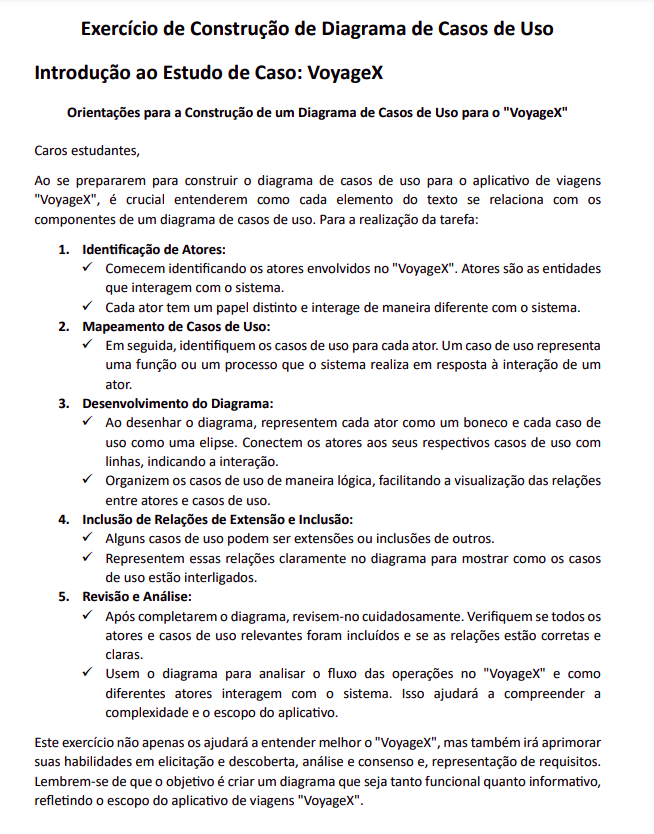
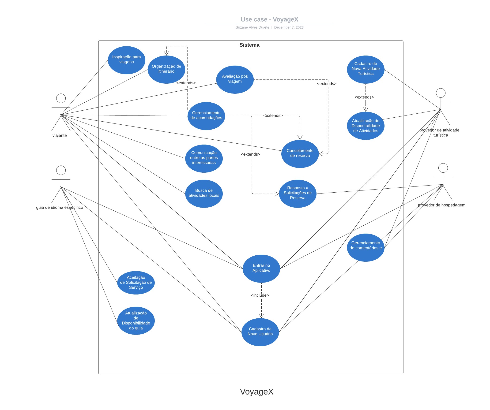

# Casos de Uso 

## Introdução

Neste artefato será apresentado o Caso de Uso do estudo de caso Voyage X apresentado a seguir: 

## **MIRO com o Caso de Uso feito pelos Moonwalkers**

<iframe width="768" height="432" src="https://miro.com/app/board/uXjVNHcKX9Y=/" frameborder="0" scrolling="no" allow="fullscreen; clipboard-read; clipboard-write" allowfullscreen></iframe>

## Diagrama 

O diagrama UML foi criado a partir da ferramenta chamada Lucidchart, conforme pode ser visto a seguir: 

