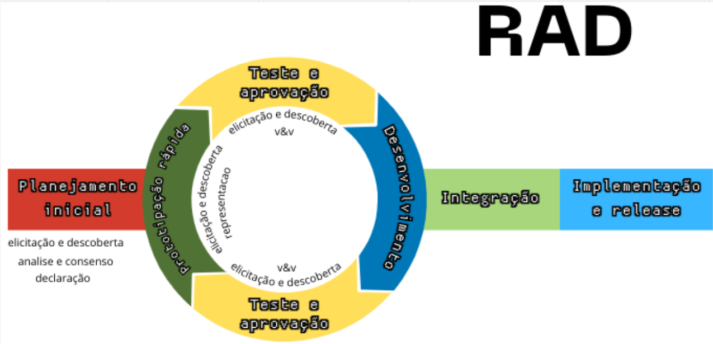

# ANA

# Overview 

- Da Visão de produto

- Dos processo que executamos, se vcs executaram e como executamos - Inserir evidências do processo (explicar sobre os testes de aprovação com o cliente presencialmente etc etc)

- Do Planejamento (informar se seguimos ou não, justificativas do por que nao seguir)

## **Visão de produto**

1. Qual é o produto que você se propõe a desenvolver? Um jogo mobile com a temática de gamificação semelhante à utilizada na matéria de requisitos de software.

2. O que torna este produto diferente dos seus concorrentes? Não existe nenhum outro jogo desenvolvido nessa disciplina. Dessa forma, essa escolha demonstra ser uma opção inovadora.

3. Quem são os usuários-alvo e clientes do produto? Os usuários-alvo são os próprios alunos de requisitos de software com o professor George Marsicano Corrêa. Já o cliente do produto serão os membros da equipe do Super-R

4. Por que os clientes deveriam utilizar / comprar este produto? Além de compreender melhor a temática da gamificação da matéria e aumentar a imersão na mesma, é um jogo que além de entreter, conta com perguntas da matéria para revisão dos alunos. O jogo também foi produzido de forma a também aumentar a interação entre os próprios aluons no primeiro dia de aula.

### **Conclusão**:
 Conseguimos criar um produto que atendeu as expectativas dos clientes, que fosse um jogo divertido, que introduziria os alunos que estão começando a matéria de requisitos à gamificação além de revisar a matéria de pré-requisito, métodos de desenvolvimento de software.

## O nosso processo: RAD

O Rapid Application Development, ou Desenvolvimento Rápido de Aplicação, é uma metodologia de desenvolvimento de software que prioriza um ciclo de trabalho curto, iterativo e incremental. Trata-se de um método que foi projetado para substituir as tradicionais técnicas de desenvolvimento, como o modelo cascata, que apresentavam processos mais lentos e pouco flexíveis.

Além disso, o RAD supre a necessidade de planejamento inicial mais detalhado e, como são frequentes as iterações, a equipe que é inexperiente e provavelmente vai cometer erros comuns de quem está aprendendo, vai conseguir errar rápido e aprender rápido para a nova iteração ou na própria prototipação.

- Escolha da abordagem ágil.
- Curto período de tempo para entrega.
- Ter feedbacks constantes em cima de protótipos seria de muita utilidade por se tratar de um jogo.

### Kanbam

Nessa seção, apresentamos o Kanbam da equipe seguindo o processo escolhido (RAD). Disponibilizamos ele de forma iterativa através do Miro, e em formato de tabela a seguir, além de uma imagem do processo.

### Miro Utilizado para confecção do Kanbam

<iframe width="768" height="432" src="https://miro.com/app/board/uXjVNOv3H60=/" frameborder="0" scrolling="no" allow="fullscreen; clipboard-read; clipboard-write" allowfullscreen></iframe>

| -          | -               | Planejamento inicial                                                                                                                                                 | Prototipação rápida | Teste e aprovação | Desenvolvimento                                                                                                                                                                                                                                                                                                                                | Teste e aprovação | Integração                                                                                                                              | OK / Implementação e release                                                                                                                                                                                                                                       |
| ---------- | --------------- | -------------------------------------------------------------------------------------------------------------------------------------------------------------------- | ------------------- | ----------------- | ---------------------------------------------------------------------------------------------------------------------------------------------------------------------------------------------------------------------------------------------------------------------------------------------------------------------------------------------- | ----------------- | --------------------------------------------------------------------------------------------------------------------------------------- | ------------------------------------------------------------------------------------------------------------------------------------------------------------------------------------------------------------------------------------------------------------------ |
| Iteração 1 | 11/09 até 27/09 |                                                                                                                                                                      |                     |                   |                                                                                                                                                                                                                                                                                                                                                |                   | Sprites da Crys  Sprites do NPC Guardião  Sprites do NPC Explorador  Itens de cada subregião do mapa  Mini-mapa | Elicitação de requisitos ( inicio da construção do BackLog)                                                                                                                                                                                                        |
| Iteração 2 | 03/10 até 25/10 |                                                                                                                                                                      |                     |                   |                                                                                                                                                                                                                                                                                                                                                |                   | Sprites Mãe da Crys  Subregiões do mapa                                                                                           | Atualização do Backlog   Definição e alterações no enredo  Desenvolvimento inicial DOD e DOR  Veri/Val do DoR e DoD dos insurgentes  Atividades com os Insurgentes  Configuração do ambiente inicial                                 |
| Iteração 3 | 31/10 até 27/11 |                                                                                                                                                                      |                     |                   | US4 - pescar o oniguiri-mecanica  US6 - Mini-game Pesca  US1 - Mini-mapa  US3 - Movimentar 4 direções  RFN6 - Ler a história de calamum caeruleum  US9 - dialogar NPCs  Sprites do Comandante Estelar  Sprites do NPC Caçadores de Recompensa  RFN2 sprites animados  Sprite Crys parada |                   | Arte de elementos do mini-game de pesca  Sprites do NPC Mercenários                                                               | Critérios de Aceitação   PBB HealthNet  Criação dos BDD's, e verificações dos Insurgentes  Registros Planning, Review e Retrospectiva  Enredo do projeto  Aprimoramento DOD e DOR após feedbacks  Atualizações na documentação |
| Iteração 4 | 28/11 até 05/12 | US2 - acessar todas as subáreas   US5 - Mini-game Shape - pular mecânica  US7 jogar minigame shape  US10 - Escolher facção   US11 - QUIZ NPC |                     |                   |                                                                                                                                                                                                                                                                                                                                                |                   |                                                                                                                                         |                                                                                                                                                                                                                                                                    |
| Iteração 5 | 06/12 até 13/12 | US8- Salvar progresso  RFN4 - Efeitos sonoros  US12 - Minicarderno de atividades  RFN1 - Aumentar e diminuir o volume  RFN5 - música tema    |                     |                   |                                                                                                                                                                                                                                                                                                                                                |                   |                                                                                                                                         |                                                                                                                                                                                                                                                                    |

### **Conclusão** :
Para seguir o RAD, criamos esse Kanban no MIRO onde colocamos cada fase do RAD e todas as atividades que tínhamos pendentes. No início ficamos com dificuldades para seguir e se adaptar, mas a partir do feedback do final da segunda missão nos organizamos e seguimos o processo. Os testes e aprovações foram feitos várias vezes ao longo do semestre no final da aula, onde rapidamente mostrávamos o que tínhamos feito e recebíamos feedback sobre as entregas e logo depois a tarefa avançava no Kanban

## **Planejamento**

### **Conclusão** :
No planejamento inicial, tínhamos 17 requisitos (US e RFN) para serem cumpridos. No entanto, um dia antes de iniciar o desenvolimento, nosso colega Pedro teve que sair da disciplina por motivos maiores. 

Dessa forma, conversamos com nosso cliente, o professor George e negociamos o nosso planejamento. Dos 18, retiramos 4 requisitos, relacionados à música e efeitos sonoros e ao salvamento do jogo, já que concluímos que esse é um jogo que só será mais usado no primeiro dia de aula e ele é curto demais para a necessidade de salvar o estado do jogo.

Também mudamos o mini-game de plataforma para um space-shooter, clássico de fliperama, que se encaixava melhor na narrativa da disciplina.