# Produto Final

## Menu

O Crystaleum tem início em um menu com três opção: iniciar o jogo, abrir o tutorial e sair do jogo. 

<b>Imagem 1:</b> Menu

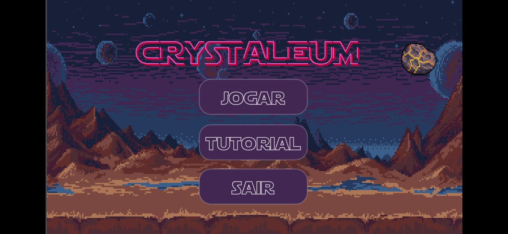

O tutorial explica três objetos interativos principais do nosso jogo: 

- O mini-mapa que fica a esquerda da tela do jogo, o qual deve ser utilzado para orientar visualmente o jogador sobre o universo de Crystaleum.
- Vários botões roxos que ficam dentro do mini-mapa, os quais devem ser utilzados para mostrar quais ambientes do universo de Crystaleum estão liberados para acesso e clicados quando o jogador quiser se movimentar para algum desses ambientes.
- O mini-caderno que fica a direito da tela do jogo, o qual deve ser utilizado para orientar o jogador a respeito dos seus próximos passos.

<b>Imagem 2:</b> Tutorial

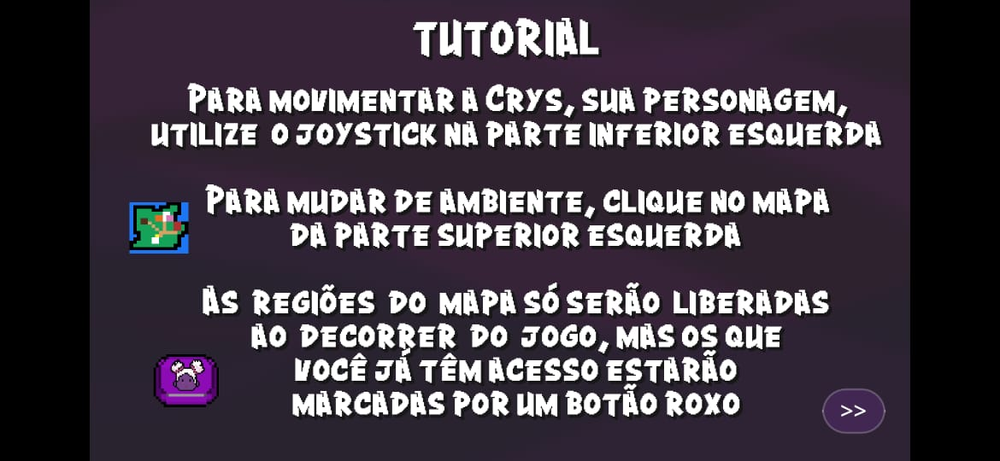

## Abertura da história 

É apresentada uma tela inicial contendo a história de Calamum, a qual é apresentada assim que o jogador iniciar o jogo. 

<b>Imagem 3:</b> História do Crystaleum

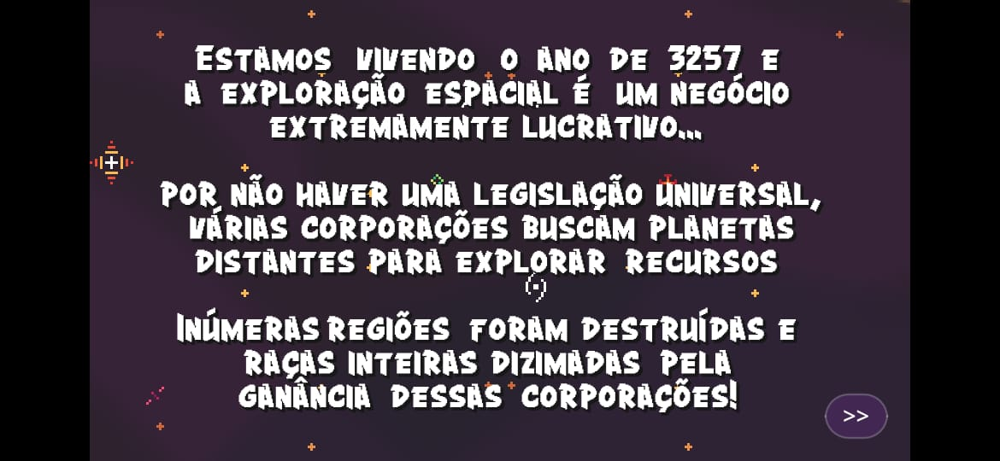

## Itens de Interação

Abaixo estão os objetos interativos que acompanharão o jogador por toda a narrativa, além de já ter sua explicação na seção de tutorial no menu do Crystaleum. Estes são:

<b>Imagem 5:</b> Mini-Mapas

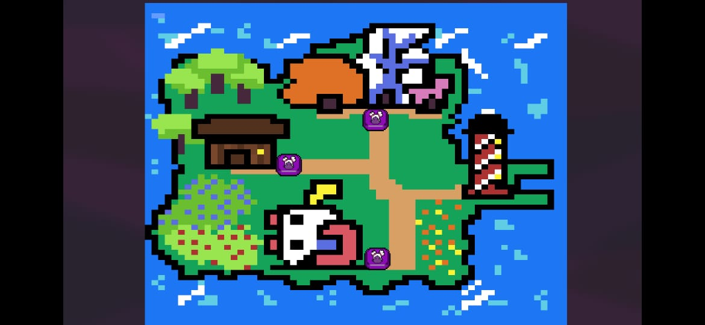

<b>Imagem 6:</b> Mini-Caderno

## Casa da Crys

A primeira fase do jogo traz a casa da Crys. Nela, a personagem encontra sua mãe e pretende saber um pouco mais sobre seu avô. 

<b>Imagem 4:</b> Casa da Crys

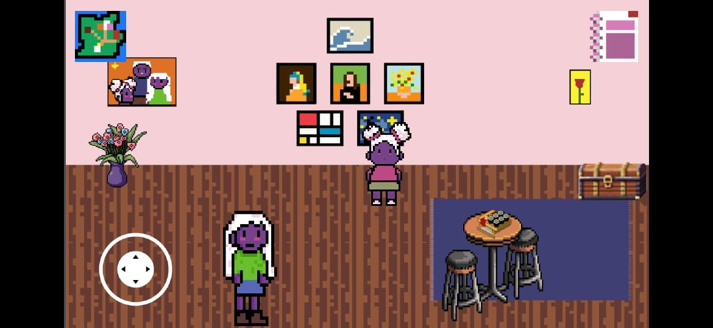

## Casa do Avô da Crys

A segunda fase do jogo se passa na casa do Avô da Crys. Nela, você consegue encontrar o diário do mesmo e descobre um pouco mais sobre o que se passa na história do universo.

<b>Imagem 7:</b> Casa do Avô da Crys

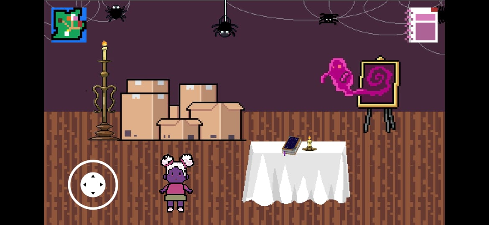

<b>Imagem 8:</b> Capa do Diário do Avô da Crys

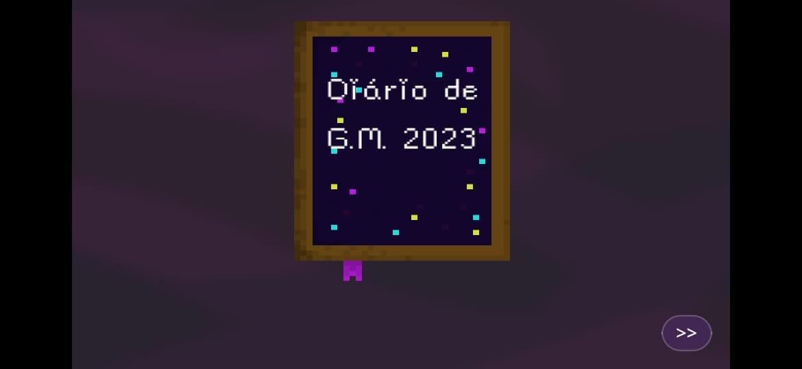

## Prédios das facções e Sede do Comando Estelar

Já na terceira fase do Crystaleum, o jogador estará em um praça com 4 NPCs, sendo que cada um explicará um pouco mais sobre as facções de Calamum Caereleum para Crys.

<b>Imagem 9:</b> Prédios das Facções

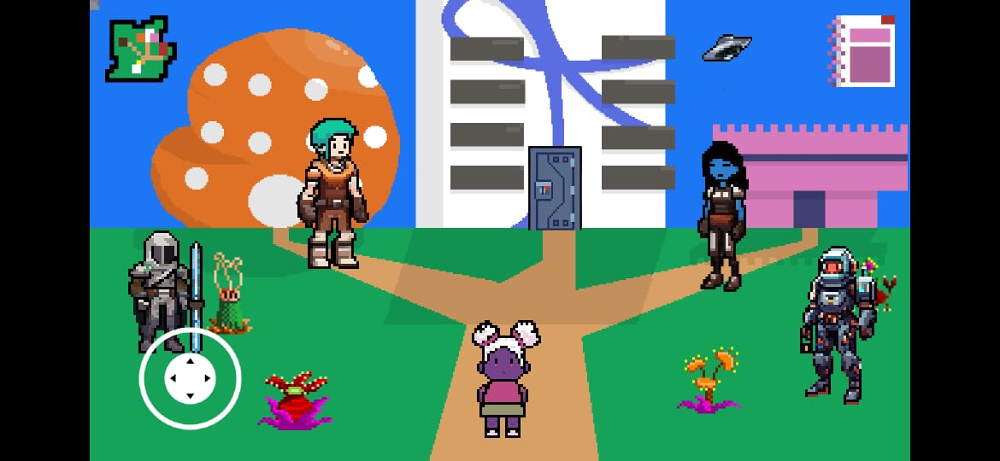

<b>Imagem 10:</b> Diálogo com os NPCs 

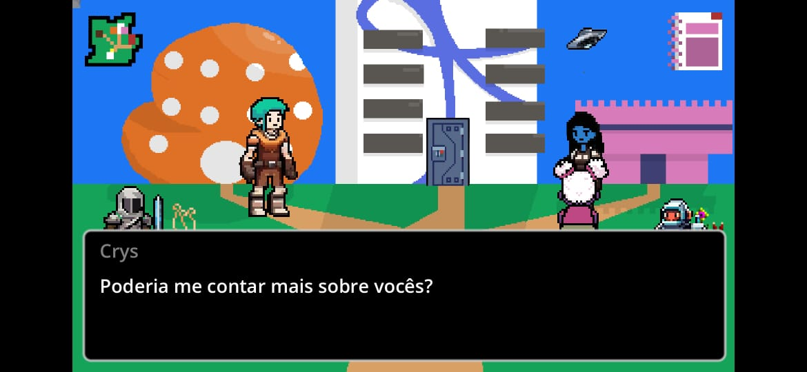

Além disso, é a primeira parte do jogo com uma porta interativa.

<b>Imagem 11:</b> Porta para a Sede do Comando Estelar 

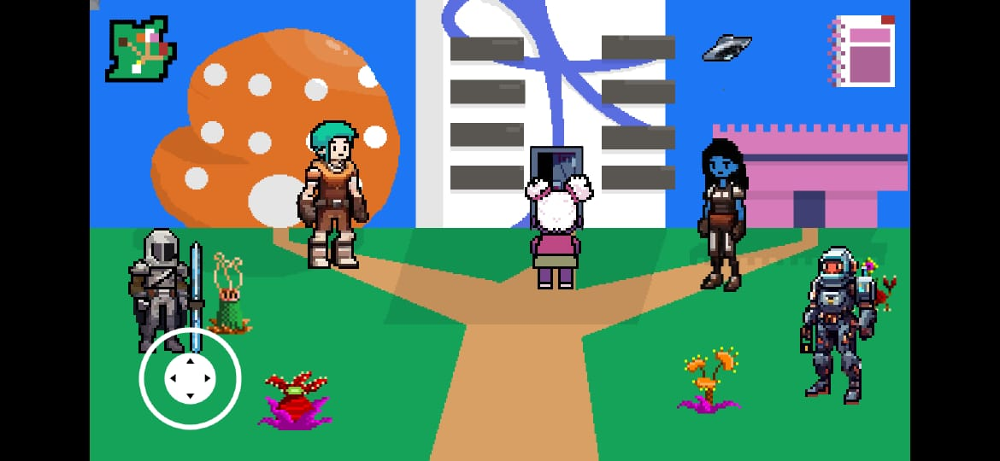

## Sede do Comando Estelar

Na Sede do Comando Estelar, temos duas principais etapas: uma conversa com o Comandante Estelar e o mini-game espacial.

<b>Imagem 12:</b> Sede do Comando Estelar 

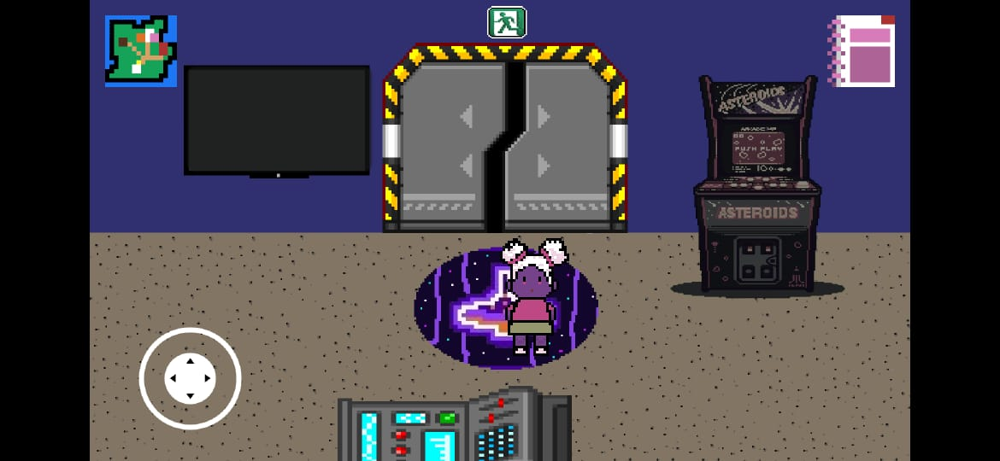

<b>Imagem 13:</b> Comandante Estelar 

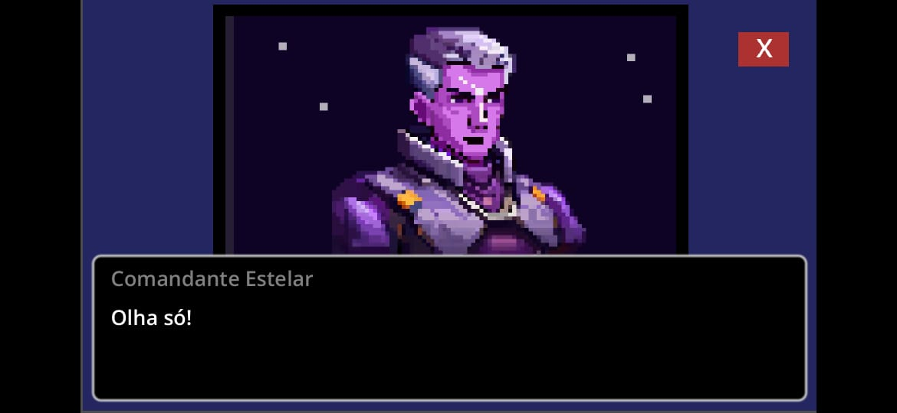

### Mini-Game Espacial

No mini-game do Espacial o jogador precisa derrotar uma quantidade x de naves dos Conglomerados para poder liberar a próxima fase do Crystaleum.

<b>Imagem 14:</b> Mini-Game Espacial 

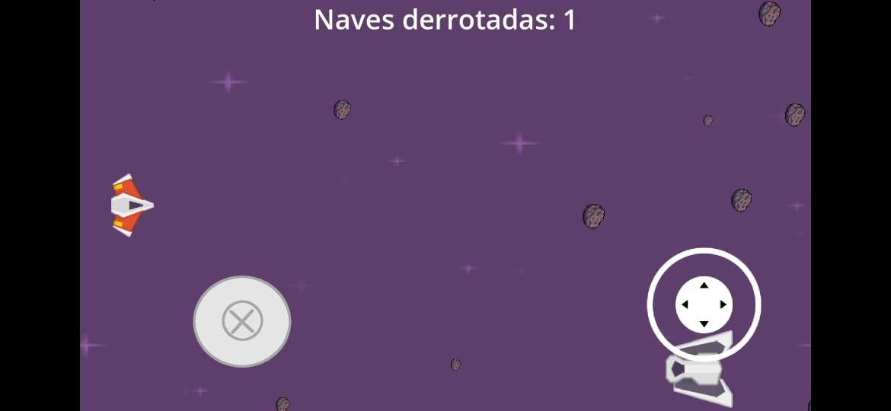

## Farol

Na última fase do Crystaleum o jogador encontra um dos vilões de Calamum Caereleum e nele precisa enfrentar outra provação para derrotá-los. 

<b>Imagem 15:</b> Farol 

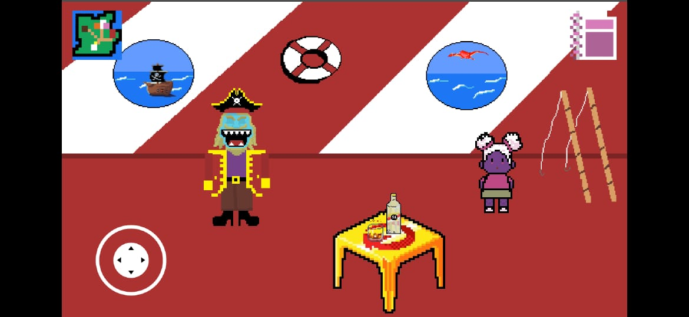

### Mini-Game Pesca

O Mini-Game da Pesca é a última grande fase do Crystaleum. Nele o jogador precisa pescar x quantidades de Onigiri para derrotar os Piratas.

<b>Imagem 16:</b> Farol 

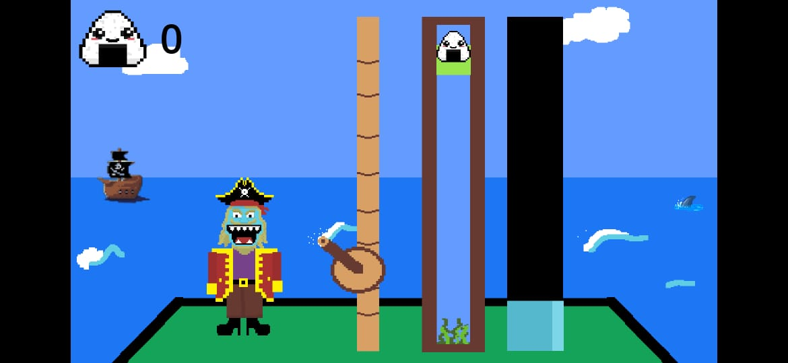

Ao vencer o record de pesca de oniguiris dos piratas, o personagem consegue a chave para abrir o baú de seu avô. A partir disso, ele abre o baú e finaliza a história. 

## Histórico de Versão

| Versão | Data       | Descrição          | Autor(es)                                        |
| ------ | ---------- | ------------------ | ------------------------------------------------ |
| 1.0    | 11/12/2023 | Criação do Conteúdo  | [Taynara Vitorino](https://github.com/taybalau) |